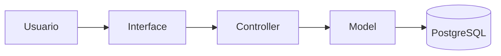
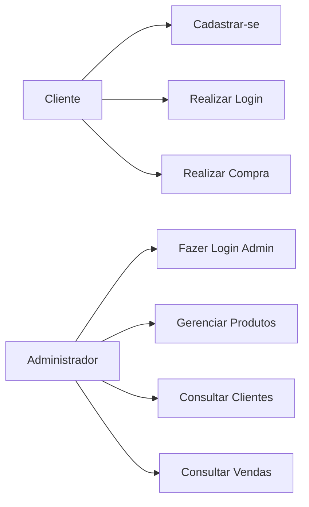
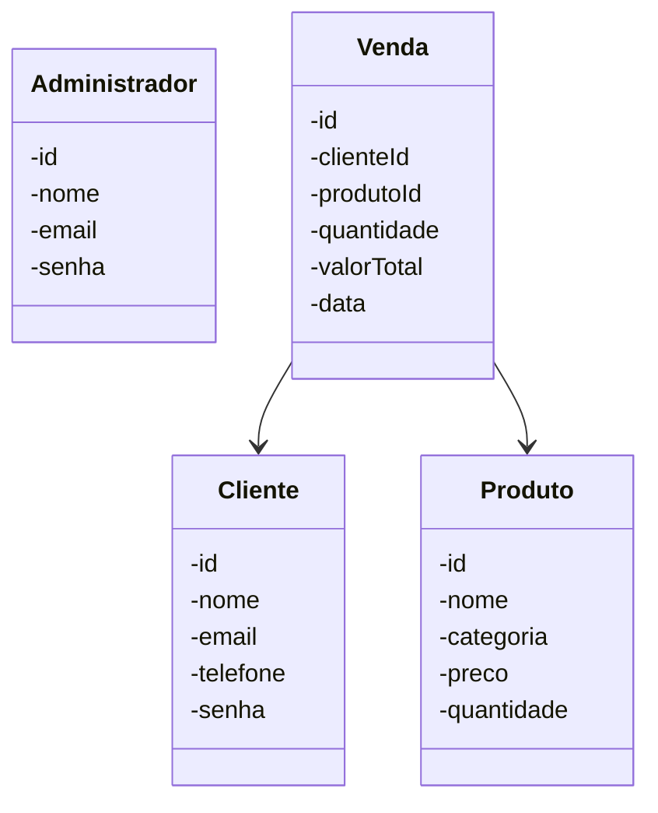
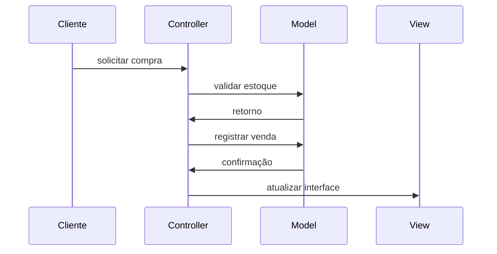
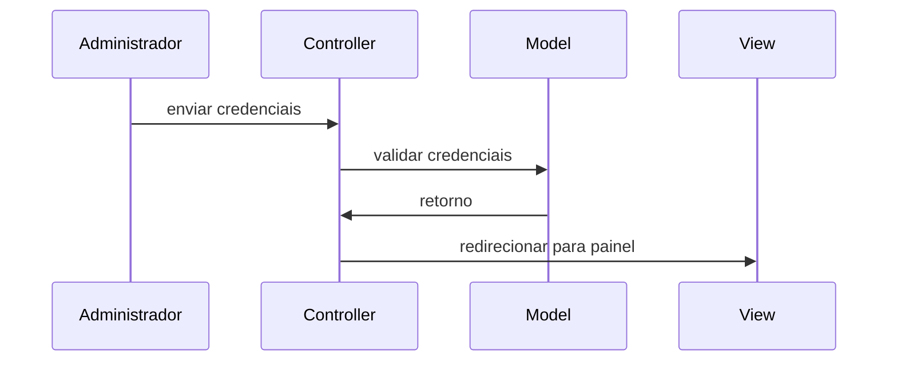
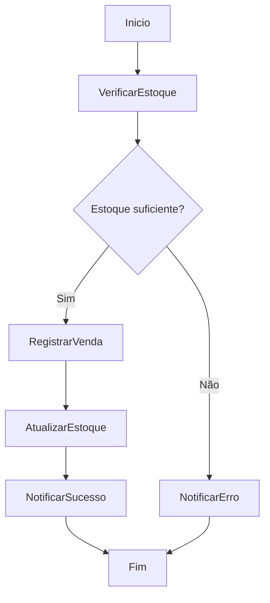
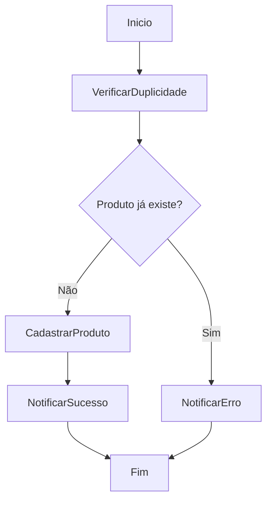
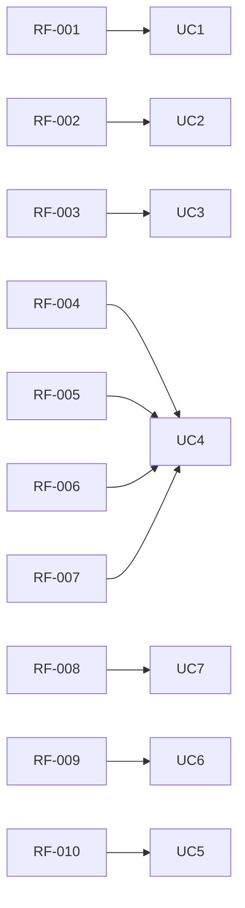

# Documentação de Especificações de Requisito de Software (SRS)

Documento baseado na ISO/IEEE 29148:2018

## Sistema de Controle de Loja de Bicicletas (GaluBikeShop)

**Padrão:** ISO/IEC/IEEE 29148:2018  
**Versão:** 1.0.0  
**Data:** 2026-04-14  
**Autor:** Gabriel Gomes de Queiroz

---

## 1. Introdução

### 1.1 Propósito

Este documento descreve os requisitos do sistema **GaluBikeShop**, com objetivo de:

- definir funcionalidades;
- padronizar entendimento entre stakeholders;
- servir como base para desenvolvimento e testes.

---

### 1.2 Escopo

O sistema permitirá:

- cadastro e autenticação de clientes e administradores;
- cadastro, listagem, edição e exclusão de produtos;
- registro de vendas com atualização automática de estoque;
- acesso a painel administrativo restrito.

O sistema será uma aplicação web utilizando:

- HTML;
- CSS;
- PHP;
- PostgreSQL.

---

### 1.3 Definições

| Termo | Definição |
| --- | --- |
| Produto | Item comercializado na loja de bicicletas |
| Venda | Registro de saída de produto associado a um cliente |
| Estoque | Quantidade disponível de produtos |
| Cliente | Usuário que realiza compras no sistema |
| Administrador | Usuário com acesso total ao painel administrativo |

**Acrônimos:**

- **SGQ** — Sistema de Gestão da GaluBikeShop
- **RF** — Requisito Funcional
- **RNF** — Requisito Não Funcional

---

### 1.4 Visão Geral do Documento

Este documento está organizado em:

- introdução e visão geral;
- descrição do sistema;
- requisitos detalhados;
- modelos UML;
- regras de negócio.

---

## 2. Descrição Geral do Sistema

### 2.1 Perspectiva do Sistema

O sistema é uma aplicação web com back-end em PHP e banco de dados PostgreSQL, operada em navegador.

---

### 2.2 Funções do Sistema

O sistema deve:

- cadastrar e autenticar clientes e administradores;
- cadastrar, listar, editar e excluir produtos;
- registrar vendas vinculadas a clientes e produtos;
- atualizar o estoque após cada venda;
- restringir o acesso ao painel administrativo.

---

### 2.3 Classes de Usuários

| Usuário | Descrição |
| --- | --- |
| Cliente | Pode se cadastrar, fazer login e visualizar produtos |
| Administrador | Gerencia produtos, clientes, vendas e acessa painel admin |

---

### 2.4 Ambiente Operacional

- Navegador web (Chrome, Edge, Firefox);
- Servidor com suporte a PHP;
- Banco de dados PostgreSQL.

---

### 2.5 Restrições

- Clientes não têm acesso ao painel administrativo;
- Administradores são cadastrados diretamente no banco de dados;
- Sessões PHP controlam o acesso às áreas protegidas.

### 2.6 Suposições

- O usuário possui conhecimentos básicos de informática;
- O volume de dados é pequeno a médio.

---

## 3. Requisitos do Sistema

### 3.1 Requisitos Funcionais

#### RF-001: Cadastro de Cliente

**Descrição:** Permitir que um novo cliente se cadastre no sistema.

- **Prioridade:** Alta
- **Versão:** 1.0
- **Data:** 2026-04-14
- **Rastreabilidade:** Necessidade do Stakeholder 001

**Critérios de Aceitação:**

- [ ] Entrada de dados: Nome, E-mail, Telefone, Senha
- [ ] Validação de campos obrigatórios
- [ ] Verificação de duplicidade de e-mail
- [ ] Saída: Notificação de sucesso ou erro ao usuário

---

#### RF-002: Login de Cliente

**Descrição:** Permitir que clientes cadastrados façam login no sistema.

- **Prioridade:** Alta
- **Versão:** 1.0
- **Data:** 2026-04-14
- **Rastreabilidade:** Necessidade do Stakeholder 002

**Critérios de Aceitação:**

- [ ] Entrada de dados: E-mail, Senha
- [ ] Validação de credenciais
- [ ] Criação de sessão ao autenticar
- [ ] Saída: Redirecionamento ou mensagem de erro

---

#### RF-003: Login de Administrador

**Descrição:** Permitir que administradores façam login e acessem o painel administrativo.

- **Prioridade:** Alta
- **Versão:** 1.0
- **Data:** 2026-04-14
- **Rastreabilidade:** Necessidade do Stakeholder 003

**Critérios de Aceitação:**

- [ ] Entrada de dados: E-mail, Senha
- [ ] Validação de credenciais de administrador
- [ ] Acesso restrito ao painel admin
- [ ] Saída: Redirecionamento ou mensagem de erro

---

#### RF-004: Cadastro de Produto

**Descrição:** Permitir que administradores cadastrem novos produtos.

- **Prioridade:** Alta
- **Versão:** 1.0
- **Data:** 2026-04-14
- **Rastreabilidade:** Necessidade do Stakeholder 004

**Critérios de Aceitação:**

- [ ] Entrada de dados: Nome, Categoria, Preço, Quantidade
- [ ] Validação de campos obrigatórios
- [ ] Verificação de duplicidade
- [ ] Saída: Notificação ao usuário

---

#### RF-005: Listagem de Produtos

**Descrição:** Exibir os produtos cadastrados no sistema.

- **Prioridade:** Alta
- **Versão:** 1.0
- **Data:** 2026-04-14
- **Rastreabilidade:** Necessidade do Stakeholder 005

**Critérios de Aceitação:**

- [ ] Listagem de todos os produtos
- [ ] Saída: Id, Nome, Categoria, Preço, Quantidade

---

#### RF-006: Edição de Produto

**Descrição:** Permitir que administradores editem os dados de produtos existentes.

- **Prioridade:** Alta
- **Versão:** 1.0
- **Data:** 2026-04-14
- **Rastreabilidade:** Necessidade do Stakeholder 006

**Critérios de Aceitação:**

- [ ] Verificar se o produto está cadastrado
- [ ] Entrada de dados: Nome, Categoria, Preço, Quantidade
- [ ] Validação de campos
- [ ] Saída: Notificação ao usuário

---

#### RF-007: Exclusão de Produto

**Descrição:** Permitir que administradores excluam produtos do sistema.

- **Prioridade:** Alta
- **Versão:** 1.0
- **Data:** 2026-04-14
- **Rastreabilidade:** Necessidade do Stakeholder 007

**Critérios de Aceitação:**

- [ ] Verificar se o produto existe
- [ ] Confirmação antes da exclusão
- [ ] Saída: Notificação de sucesso ou erro

---

#### RF-008: Registro de Venda

**Descrição:** Permitir o registro de vendas vinculadas a clientes e produtos.

- **Prioridade:** Alta
- **Versão:** 1.0
- **Data:** 2026-04-14
- **Rastreabilidade:** Necessidade do Stakeholder 008

**Critérios de Aceitação:**

- [ ] Venda associada a cliente e produto cadastrados
- [ ] Verificação de quantidade em estoque
- [ ] Cálculo automático do valor total
- [ ] Atualização do estoque após a venda
- [ ] Saída: Notificação de venda realizada

---

#### RF-009: Listagem de Vendas

**Descrição:** Exibir o histórico de vendas realizadas.

- **Prioridade:** Média
- **Versão:** 1.0
- **Data:** 2026-04-14
- **Rastreabilidade:** Necessidade do Stakeholder 009

**Critérios de Aceitação:**

- [ ] Listagem de todas as vendas registradas
- [ ] Saída: Id da venda, cliente, produto, quantidade, valor total

---

#### RF-010: Listagem de Clientes (Admin)

**Descrição:** Permitir que administradores visualizem os clientes cadastrados.

- **Prioridade:** Média
- **Versão:** 1.0
- **Data:** 2026-04-14
- **Rastreabilidade:** Necessidade do Stakeholder 010

**Critérios de Aceitação:**

- [ ] Acesso restrito a administradores
- [ ] Saída: Id, Nome, E-mail, Telefone

---

### 3.2 Requisitos Não Funcionais

#### RNF-001: Usabilidade

**Descrição:** Interface organizada, profissional e intuitiva para clientes e administradores.

---

#### RNF-002: Desempenho

**Descrição:** O sistema deve apresentar respostas rápidas em operações simples, considerando o uso local e baixo volume de dados.

---

#### RNF-003: Tecnologia de Back-end

**Descrição:** Desenvolvimento do back-end utilizando PHP.

---

#### RNF-004: Banco de Dados

**Descrição:** Utilização de PostgreSQL como sistema de gerenciamento de banco de dados.

---

#### RNF-005: Consistência Visual

**Descrição:** CSS padrão aplicado a todas as páginas do sistema.

---

#### RNF-006: Controle de Acesso

**Descrição:** Utilização de sessões PHP para controlar o acesso às áreas protegidas.

---

#### RNF-007: Confiabilidade

**Descrição:** Validação de entrada de dados obrigatória em todas as operações críticas.

---

## 4. Regras de Negócio

| Regra de Negócio | Descrição |
| --- | --- |
| RN-001 | Um cliente deve possuir nome, e-mail, telefone e senha |
| RN-002 | Um administrador deve possuir nome, e-mail e senha |
| RN-003 | Apenas administradores podem cadastrar, editar e excluir produtos |
| RN-004 | Apenas administradores podem visualizar todos os clientes cadastrados |
| RN-005 | Um produto deve possuir nome, quantidade, categoria e preço |
| RN-006 | Preço e quantidade de produtos não podem ser negativos |
| RN-007 | Uma venda deve estar relacionada a um cliente e a um produto cadastrados |
| RN-008 | Não pode ser registrada uma venda sem informar cliente, produto e quantidade |
| RN-009 | Não pode ser realizada uma venda se a quantidade solicitada for maior que o estoque disponível |
| RN-010 | Após uma venda, a quantidade do produto deve ser atualizada no estoque |
| RN-011 | O sistema deve calcular o valor total da venda automaticamente |
| RN-012 | O sistema deve exibir mensagens de erro ou sucesso em todas as operações |

---

## 5. Modelos do Sistema

### 5.1 Diagrama de Casos de Uso

---

### 5.2 Diagrama de Classes UML

---

### 5.3 Diagrama de Sequência

#### 5.3.1 Registro de Venda

#### 5.3.2 Login de Administrador

---

### 5.4 Diagrama de Atividades

#### 5.4.1 Registro de Venda

#### 5.4.2 Cadastro de Produto

---

## 6. Banco de Dados

### 6.1 Tabelas do Sistema

| Tabela | Descrição |
| --- | --- |
| clientes | Armazena dados dos clientes cadastrados |
| administradores | Armazena dados dos administradores |
| produtos | Armazena dados dos produtos da loja |
| vendas | Armazena os registros de vendas realizadas |

---

## 7. Protótipo

O protótipo de baixa fidelidade das telas do sistema foi desenvolvido no Figma.

[Ver protótipo no Figma](https://www.figma.com/proto/ioIFVbsbrJZPoFXoC3igVs/Sem-t%C3%ADtulo?node-id=0-1&t=wFj6Lg8E7tDvhZeN-1)

---

## 8. Controle de Versão

### 8.1 Rastreabilidade

